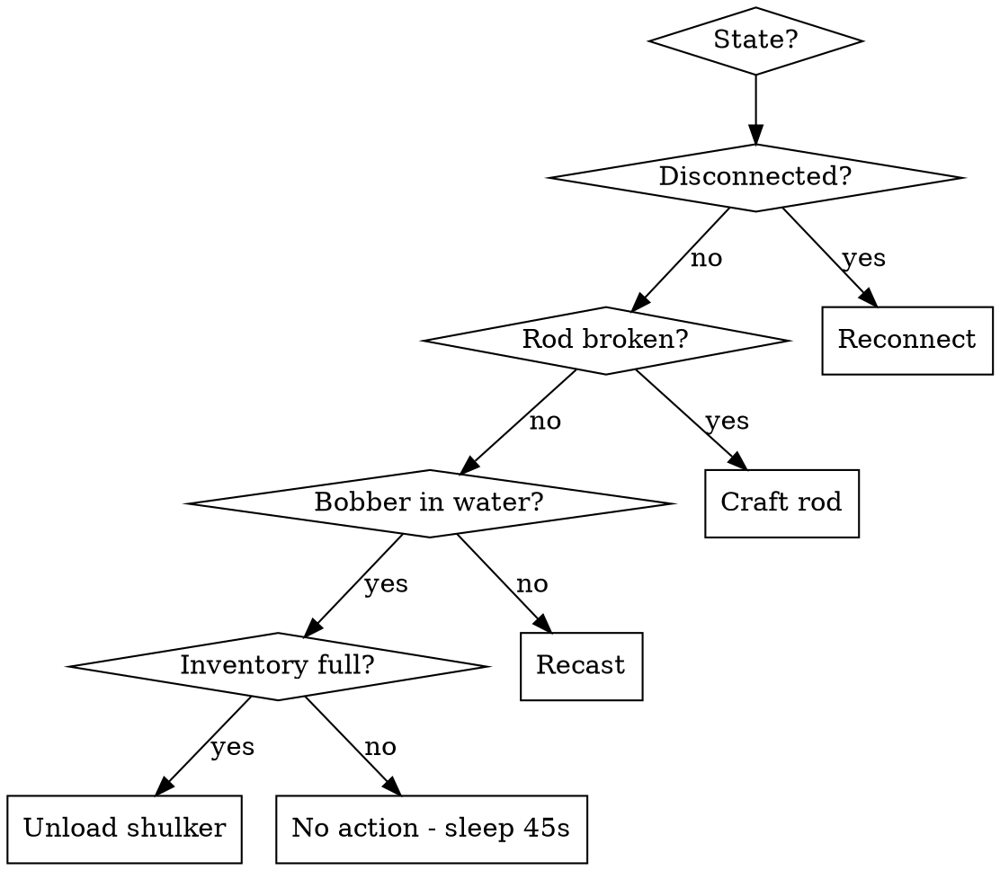

# Fishing OODA Loop

Automated fishing monitor for 2b2t Minecraft using Playwright MCP to interact with the game via noVNC.

## Overview

Runs a continuous **Observe → Orient → Decide → Act** loop that:
- Keeps Meteor Client's `auto-fish` module running
- Detects and replaces broken fishing rods
- Monitors inventory and unloads to nearby shulker boxes
- Reconnects if disconnected from server

## Prerequisites

- Docker container `headlessmc-bot` running with noVNC on port 6080
- Meteor Client installed with `auto-fish` module available
- Player positioned at a fishing spot with water in view
- Fishing rod in hotbar slot 1
- Sticks and string in inventory (for crafting replacement rods)
- Shulker box placed nearby for inventory unloading

## OODA Loop Procedure

Run this loop continuously. Each cycle takes a screenshot, analyzes state, and acts.

### Step 0: Connect to noVNC

```
1. browser_navigate → http://localhost:6080/vnc.html
2. browser_click → Connect button
3. Wait 3 seconds for VNC canvas to load
4. browser_take_screenshot → verify game is visible
5. Click center of canvas to grab mouse focus
```

### Step 1: OBSERVE

Take a screenshot and read HeadlessMC console output:

```
1. browser_take_screenshot → save as mc-ooda-{timestamp}.png
2. Bash: docker exec headlessmc-bot screen -S hmc -X hardcopy /tmp/scr && docker exec headlessmc-bot tail -40 /tmp/scr
3. Analyze screenshot for:
   - Is fishing rod visible in hand? (wooden stick shape on right side of screen)
   - Is bobber visible in water? (red/white float on water surface)
   - Is the hotbar visible? (9 slots at bottom of screen)
   - Is a GUI/menu open? (inventory, crafting table, shulker)
   - Is there a disconnect screen?
4. Analyze console for keywords (see Orient)
```

### Step 2: ORIENT

Evaluate the state based on observations:

| Signal | Source | Meaning |
|--------|--------|---------|
| No rod in hand (no stick shape on right side) | Screenshot | Rod broke → need craft |
| No bobber in water | Screenshot | Need to cast or re-enable auto-fish |
| Bobber on land (not in water) | Screenshot | Recast needed - reel in and aim at water |
| `Connection lost` / `Disconnected` | Console | Server disconnect → reconnect |
| `[Meteor]` + `off` near `Auto Fish` | Console | Auto-fish disabled → re-enable |
| Inventory mostly full (check periodically) | Screenshot of inventory | Need shulker unload |
| GUI/menu open unexpectedly | Screenshot | Close it first (press Escape) |
| `kicked` / `banned` | Console | Alert user, stop loop |

### Step 3: DECIDE

Based on orient, pick action(s) in priority order:



### Step 4: ACT

#### Action: Reconnect
```
Bash: docker exec headlessmc-bot screen -S hmc -X stuff "connect 2b2t.org\n"
Wait 30s, then re-observe (queue may take hours)
```

#### Action: Enable Auto-Fish
```
1. Click canvas center to focus
2. Press 't' to open chat
3. Type: .toggle auto-fish
4. Press Enter
5. Wait 1s, screenshot to verify "Toggled Auto Fish on" in chat
```

#### Action: Recast Rod
```
1. Click canvas center to focus
2. Press '1' to select hotbar slot 1 (rod)
3. Right-click to reel in current cast
4. Wait 500ms
5. Verify crosshair (+) is aimed at water (center of blue area)
6. If crosshair is on land, move mouse toward water to rotate view
7. Right-click to cast
8. Wait 1.5s, screenshot to confirm bobber is in water
```

#### Action: Craft Fishing Rod
Recipe: 3 sticks + 2 string in crafting table (3x3 grid)
```
Layout:
  [  ][     ][stick ]
  [  ][stick][string]
  [stick][  ][string]

Steps:
1. Click canvas to focus
2. Look down to find crafting table (move mouse down to rotate view)
3. Right-click crafting table to open GUI
4. Screenshot to verify crafting GUI opened
5. If no crafting table found:
   a. Open inventory (press 'e')
   b. Find crafting table in inventory
   c. Close inventory, place it (select slot, right-click ground)
   d. Right-click to open
6. In crafting GUI:
   a. Click sticks from inventory, place in grid positions
   b. Click string from inventory, place in grid positions
   c. Click result slot to craft
   d. Move fishing rod to hotbar slot 1
7. Press Escape to close
8. Press '1' to select rod
9. Enable auto-fish (see above)
10. Cast rod (right-click on water)
```

Alternative: Try Meteor command first:
```
Chat: .craft fishing_rod 1
If that doesn't work, use manual crafting above
```

#### Action: Unload to Shulker
```
1. Disable auto-fish: chat ".toggle auto-fish"
2. Press '1' to reel in rod (right-click)
3. Look around for shulker box (rotate view down/around)
4. Right-click shulker to open
5. Screenshot to verify shulker GUI opened
6. Shift-click items from player inventory rows to transfer to shulker
   - Transfer fish, junk items
   - Do NOT transfer: fishing rod, sticks, string, crafting table
7. Screenshot to verify transfer
8. Press Escape to close shulker
9. Re-enable auto-fish: chat ".toggle auto-fish"
10. Select rod (press '1'), cast (right-click on water)
```

#### Action: Check Inventory (periodic, every ~6 cycles)
```
1. Press 'e' to open inventory
2. Screenshot
3. Count filled vs empty slots visually
4. Press Escape to close
5. If > 22 of 27 main inventory slots filled → set inventoryFull = true
```

### Step 5: LOOP

After acting, wait 45 seconds then return to Step 1.

Report status to the user every 5 cycles with a brief summary.

## Quick Reference

| Meteor Command | Purpose |
|---|---|
| `.toggle auto-fish` | Enable/disable auto fishing |
| `.craft fishing_rod 1` | Try to auto-craft a rod |

| HeadlessMC Command | Purpose |
|---|---|
| `connect 2b2t.org` | Connect to server |

| Key | In-Game Action |
|---|---|
| `t` | Open chat |
| `e` | Open inventory |
| `Escape` | Close GUI |
| `1`-`9` | Select hotbar slot |
| Right-click | Cast/reel rod, open container, use item |
| Shift+click | Quick-transfer item in GUI |

## Common Issues

- **Bobber keeps landing on grass**: View is aimed at land edge. Move mouse toward center of water body before casting.
- **Auto-fish toggles off randomly**: Re-enable via `.toggle auto-fish`. May happen after death or dimension change.
- **VNC canvas not focused**: Click center of canvas before sending any keyboard input.
- **Chat opens instead of game action**: Press Escape first to ensure no GUI is open, then retry.
- **Kicked from server**: Check console for reason. If queue timeout, reconnect. If kicked for AFK, the fishing should prevent this.
